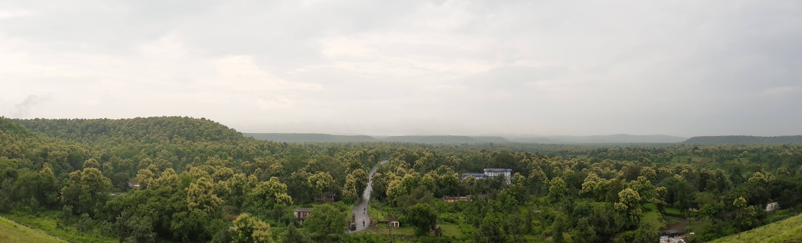

I am an economic geographer and post-doctoral researcher at the University of Liverpool. My work sits at the intersection of urban economics, colonial institutional history, and spatial inequality — with a growing interest in satellite remote sensing as a way to bring new data to bear on these questions.

I am currently a Post-Doctoral Research Associate at [Imago](https://imago.liverpool.ac.uk), the UKRI Imagery Data Service at the University of Liverpool. Currently, I work on the Sun Probability Framework a satellite data project that uses high-resolution Sentinel-2 cloud masks to make a measure of sunlight exposure across the UK. More broadly, I am excited about bringing imagery-derived  data to bear on questions about equity, development, and housing where administrative data is scarce or unreliable.

I grew up in India, and questions about cities — why some grow and others don't, who gets to own a home, and how the past casts long shadows on the present — have shaped my research. My PhD at LSE's Department of Geography and Environment examined how colonial institutions and contemporary financial markets together produce persistent patterns of spatial inequality and urban development in India. 

Before my PhD, I worked at the Centre for Social and Economic Policy (formerly Brookings Institution India Center) in New Delhi, where I worked on housing, property rights, and urban infrastructure. I hold a Master's degree in Urban Policy and Governance from the Tata Institute of Social Sciences, Mumbai, and an undergraduate degree in Economics from the University of Delhi.

Outside research, I mentor young women from South Asia who are pursuing careers in economics and policy. 

::: {style="margin-top: 3rem; margin-right: -2rem;"}

:::
::: {style="font-size: 0.75rem; color: #879758; letter-spacing: 0.03em; margin-top: 0.4rem;"}
Kerwa Dam, Bhopal, monsoon 2019.
:::